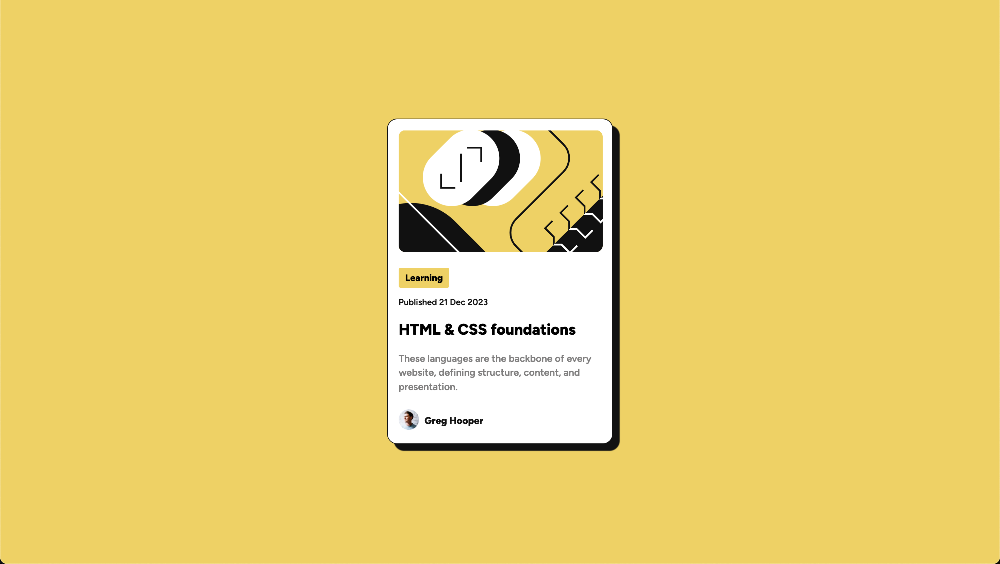
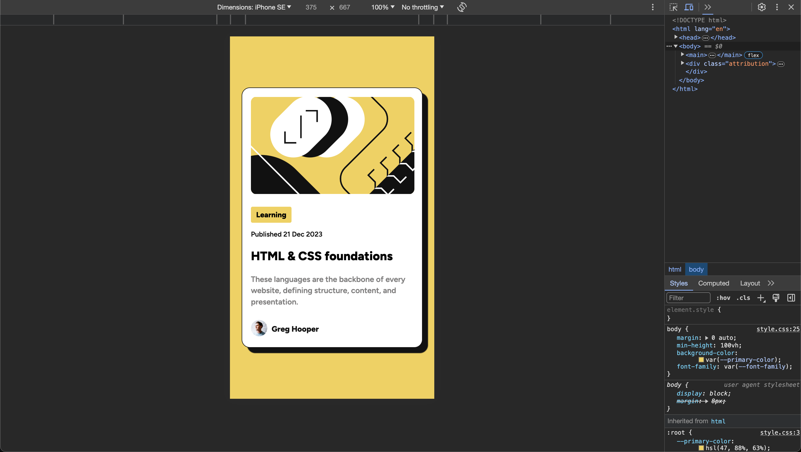
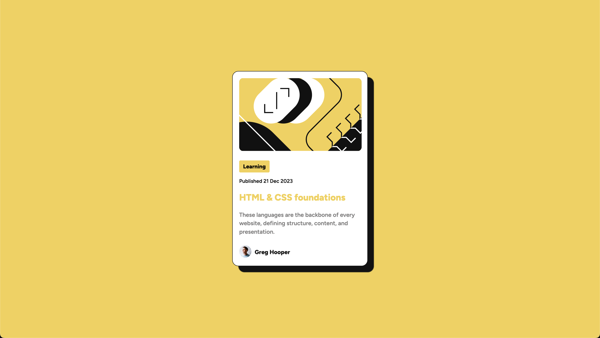

# Frontend Mentor - Blog preview card solution

This is a solution to the [Blog preview card challenge on Frontend Mentor](https://www.frontendmentor.io/challenges/blog-preview-card-ckPaj01IcS). Frontend Mentor challenges help you improve your coding skills by building realistic projects. 

## Table of contents

- [Overview](#overview)
  - [The challenge](#the-challenge)
  - [Screenshot](#screenshot)
  - [Links](#links)
- [My process](#my-process)
  - [Built with](#built-with)
  - [What I learned](#what-i-learned)
  - [Continued development](#continued-development)
- [Author](#author)

**Note: Keep in mind I'm not a premium user and do not have the exact measurements.**

## Overview

### The challenge

Users should be able to:

- See hover and focus states for all interactive elements on the page

### Screenshot

Desktop




Mobile



Active Desktop



### Links

- Solution URL: [blog-preview-card repository](https://github.com/philipecortez/blog-preview-card)
- Live Site URL: [blog-preview-card site]( https://philipecortez.github.io/blog-preview-card/)

## My process

### Built with

- Semantic HTML5 markup
- CSS custom properties
- Flexbox

### What I learned

Learned how to define and use CSS custom properties and a litle bit more of Flexbox

```css
:root {
  --primary-color: hsl(47, 88%, 63%);
  --neutral-color-white: hsl(0, 0%, 100%);
  --neutral-color-gray: hsl(0, 0%, 50%);
  --neutral-color-black: hsl(0, 0%, 7%);
  
  /* Paragraph font-size */
  --paragraph-font-size: 1rem;

  /* font weights */
  --normal-weight: 600;
  --heavy-weight: 800;

  /* font-family */
  --font-family: 'Figtree', sans-serif;

  /* elements width */
  --article-width: 330px;
  --main-img-width: 300px;
  --footer-img-width: 30px;
}

/* using custom properties */

p {
  font-size: var(--paragraph-font-size);
}
```

### Continued development

I need to improve on CSS organization

## Author

- Frontend Mentor - [@philipecortez](https://www.frontendmentor.io/profile/philipecortez)

**Note: Delete this note and add/remove/edit lines above based on what links you'd like to share.**
